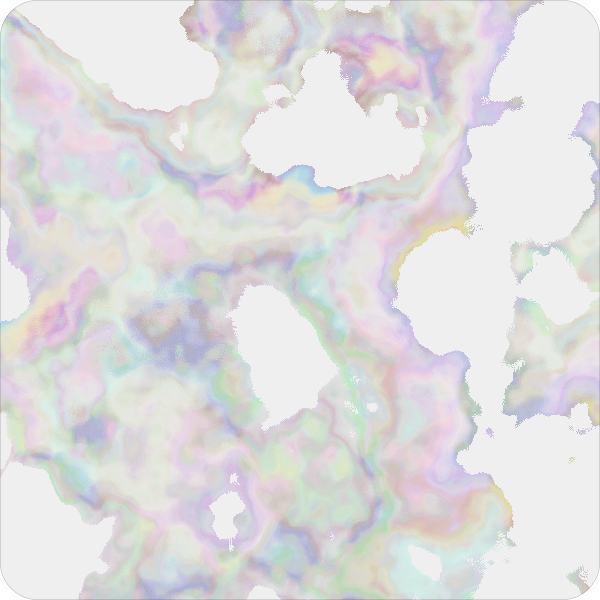

# Carbon

Various experiments with carbon credits on chain

## Lifeform

Carbon bearing NFTs, allows you to store BCT (Base Carbon Tonne) carbon credits inside of NFTs. Depending on how much you store inside compared to the total supply you can change the visual result of your carbon lifeform. Because deposits are happening constantly your Lifeform never looks the same.

## Fluid vault

Carbon lockup vault with streaming timelock, allows voters to direct tokenstream. Builds on top of Superfluid.

## Acknowledgements

These contracts were inspired by or directly modified from many sources, primarily:

- [Uniswap V3: LP Descriptor NFT](https://etherscan.io/address/0x91ae842a5ffd8d12023116943e72a606179294f3#code)
- [Solmate](https://github.com/Rari-Capital/solmate)
